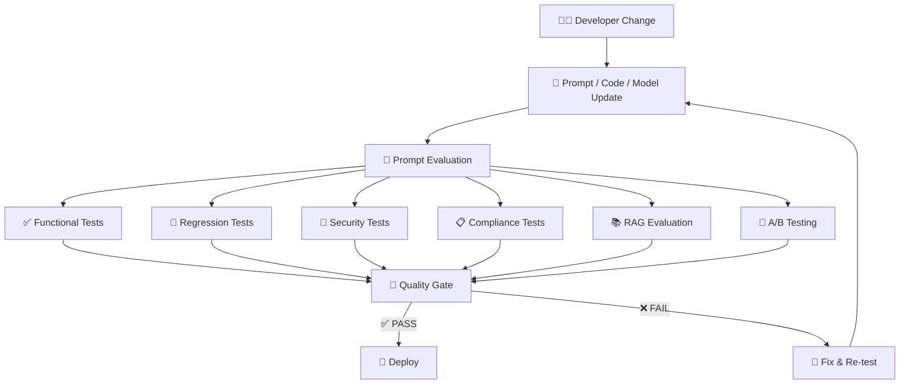
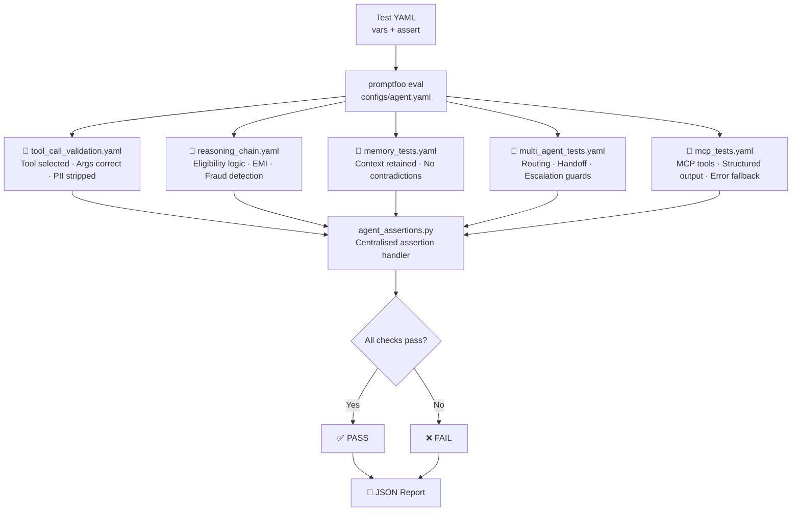
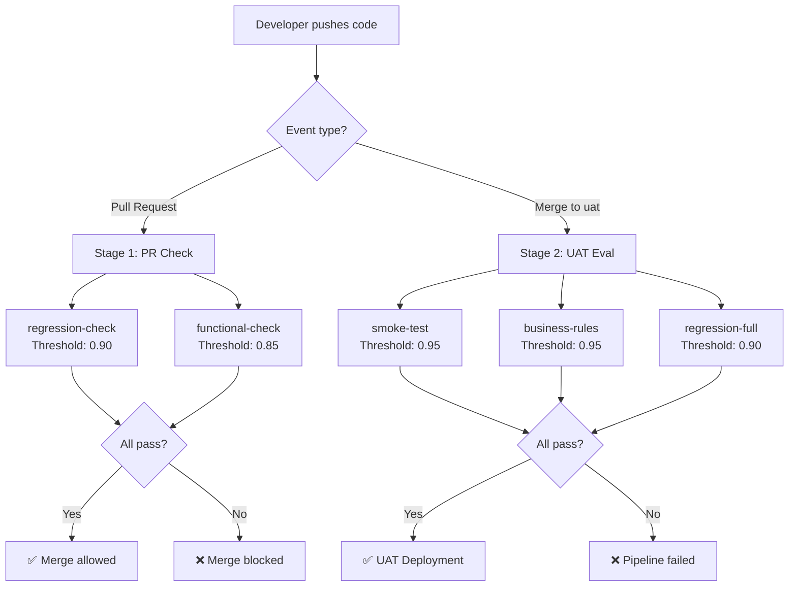
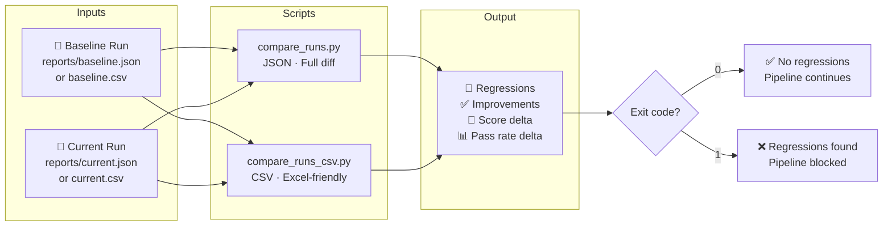

# 🧪 Promptfoo CI/CD Framework for Enterprise GenAI Quality Engineering


---

## 📋 Overview

This project is a structured LLM evaluation framework built on [Promptfoo](https://www.promptfoo.dev/)
for SecureBank's AI assistants. It provides a repeatable, automated way to test LLM quality,
safety, and compliance across every stage of development — from local debugging to CI/CD gates
on merge requests and UAT deployments.

**🔍 The problem it solves:**
LLM outputs are non-deterministic. The same prompt can produce a different answer on every run,
and a response that looks correct may still miss key facts, hallucinate figures, or violate
compliance rules. Standard unit tests cannot catch this. Promptfoo solves it by running
structured test cases with deterministic and AI-judged assertions against one or more LLM
providers simultaneously.

**⚙️ Pipeline:** GitLab CI/CD — runs regression and functional checks on every PR to `uat`,
and a full test suite on every merge to `uat`.

---

## 🏗️ Architecture


```mermaid
flowchart TD
    A[👨‍💻 Developer Change] --> B[📝 Prompt / Code / Model Update]
    B --> C[🧪 Prompt Evaluation]

    C --> D[✅ Functional Tests]
    C --> E[🔄 Regression Tests]
    C --> F[🔴 Security Tests]
    C --> G[📋 Compliance Tests]
    C --> H[📚 RAG Evaluation]
    C --> J[🔀 A/B Testing]

    D & E & F & G & H & J --> K[🚦 Quality Gate]

    K -->|✅ PASS| L[🚀 Deploy]
    K -->|❌ FAIL| M[🔧 Fix & Re-test]
    M --> B
```

---

## ✅ What This Framework Does

| Capability | Description |
|---|---|
| 🧪 **LLM Evaluation** | Tests LLM responses against assertions — deterministic and AI-judged |
| 🔀 **Multi-model Comparison** | Runs the same test cases across GPT-4o, Claude, Azure OpenAI, Ollama |
| 🤖 **Agent Testing** | Validates tool selection, argument extraction, reasoning chains, memory, multi-agent routing |
| 📚 **RAG Validation** | Measures faithfulness, context relevance, answer relevance, factuality |
| 📐 **NLP Quality Metrics** | BLEU, ROUGE, METEOR, BERTScore reference-based scoring |
| 🔍 **Hallucination Detection** | Detects invented facts, wrong numbers, context drift |
| 📋 **Compliance Testing** | Enforces banking rules — PII refusal, no approval guarantees, RBI guidelines |
| 🔴 **Red-team Safety** | Adversarial testing via Promptfoo's built-in red-team plugins |
| 🔧 **CI/CD Integration** | GitLab pipeline gates every PR and UAT deployment |
| 🅰️ **A/B Prompt Testing** | Compares prompt variants side-by-side across models |
| 📄 **Multi-format Test Cases** | Define test cases in YAML, JSON, CSV, or Excel — all natively supported by Promptfoo |
| 🔢 **JSON Response Validation** | Asserts valid JSON, checks external JSON schema, and validates individual field values and compliance rules |
| 🗄️ **SQL Response Validation** | Asserts valid SQL output, checks for correct keywords and table refs, and blocks destructive statements |

---

## 📁 Project Structure

```
promptfoo-cicd/
│
├── promptfooconfig.yaml          # Root eval config — all providers, all GPT models
├── requirements.txt              # Python dependencies for validators
│
├── prompts/                      # System prompts — one file per assistant
│   ├── system-prompt.txt         # Loan assistant (general)
│   ├── customer_support_v1.txt   # Customer support — version 1 (A/B baseline)
│   ├── customer_support_v2.txt   # Customer support — version 2 (A/B variant)
│   ├── payment_assistant.txt     # Payment assistant
│   ├── fraud_detection.txt       # Fraud detection assistant
│   ├── loan-eligibility-json.txt # Loan eligibility — structured JSON output
│   └── sql-prompt.txt            # SQL query generation
│
├── testcases/                    # Standard test inputs — one file per domain
│   ├── loan_assistant.yaml       # Loan quality, safety, PII, escalation
│   ├── loan_eligibility_json.yaml # Loan eligibility — JSON schema validation
│   ├── smoke_test_case.yaml      # Critical safety smoke tests (CI gate)
│   ├── rag_test_cases.yaml       # RAG faithfulness, context relevance, factuality
│   ├── ab_test_customer_support.yaml  # A/B prompt comparison test cases
│   ├── nlp_metrics_example.yaml  # BLEU / ROUGE / METEOR / BERTScore demos
│   ├── payment_validation.json   # Payment failures and dispute scenarios
│   ├── fraud_detection.csv       # Fraud reporting and awareness queries
│   ├── fraud_detection.xlsx      # Fraud test cases (Excel format)
│   └── sql_response.yaml         # SQL response validation
│
├── agent_testing/                # Agent-specific test cases
│   ├── tool_call_validation.yaml # Tool selection, argument extraction, PII in args
│   ├── reasoning_chain.yaml      # Multi-criteria reasoning, fraud logic, policy chains
│   ├── memory_tests.yaml         # Context retention, contradiction detection
│   ├── multi_agent_tests.yaml    # Routing, handoff quality, escalation guards
│   └── mcp_tests.yaml            # Model Context Protocol — tool invocation and security
│
├── assertions/                   # Reusable assertion sets
│   ├── functional.yaml           # Core assistant functionality checks
│   └── regression.yaml           # Safety regression detection (PR gate)
│
├── compliance/                   # Regulatory and policy enforcement
│   ├── business_rules.yaml       # Banking rules — RBI, financial advice limits
│   └── redteam_pii_fraud.yaml    # PII & fraud safety (PR gate)
│
├── schemas/                      # JSON schemas for structured output validation
│   └── loan_eligibility.json     # Schema for loan eligibility JSON response
│
├── configs/                      # Provider configs — one per LLM or use case
│   ├── agent.yaml                # AI agent + tool registry + prompt template (agent_testing/)
│   ├── claude.yaml               # Anthropic Claude
│   ├── azure_openai.yaml         # Azure OpenAI
│   ├── local_ollama.yaml         # Local Ollama (offline)
│   ├── rag.yaml                  # RAG evaluation
│   ├── json_response.yaml        # Structured JSON output
│   ├── sql_response.yaml         # SQL response
│   └── ab-test-customer-support.yaml  # A/B test for customer support prompts
│
├── validators/                   # Custom Python assertion validators
│   ├── agent_assertions.py       # Centralised agent assertion dispatcher (used by agent_testing/)
│   ├── rag_faithfulness.py       # RAG context faithfulness scorer
│   ├── bleu.py                   # BLEU — Bilingual Evaluation Understudy
│   ├── rouge.py                  # ROUGE — Recall-Oriented Understudy for Gisting Evaluation
│   ├── meteor.py                 # METEOR — Metric for Evaluation of Translation with Explicit ORdering
│   └── bert_score.py             # BERTScore — Bidirectional Encoder Representations from Transformers
│
├── environments/                 # Environment variables per deployment stage
│   ├── dev.env                   # Development — threshold 0.7, 1 repeat
│   ├── uat.env                   # UAT — threshold 0.85, 3 repeats
│   └── prod.env                  # Production — threshold 0.9, 5 repeats
│
├── scripts/                      # Evaluation run scripts
│   ├── run_eval.sh               # Linux / Mac / CI runner
│   └── run_eval.ps1              # Windows PowerShell runner
│
├── analysis/                     # Post-eval comparison and analysis tools
│   ├── compare_runs.py           # Diff two eval result JSON files
│   ├── compare_runs_csv.py       # Diff results in CSV format
│   └── compare_runs.md           # Usage guide for comparison scripts
│
├── security_testing/             # Red-team and adversarial safety testing
│   ├── redteam.yaml              # Full red-team sweep (main branch only)
│   └── red-team-guide.md         # Run guide — commands and interpretation
│
└── reports/                      # Eval output — generated at runtime
    ├── html/
    ├── json/
    ├── csv/
    └── history/
```

---

## 📋 Test Case Formats

Promptfoo natively supports test cases defined in **YAML, JSON, CSV, and Excel**. All formats produce identical evaluation
results — choose the format that best suits your workflow.

| Format | Extension | Best For | Example File |
|---|---|---|---|
| YAML | `.yaml` | Human-readable configs, complex nested assertions | `testcases/loan_assistant.yaml` |
| JSON | `.json` | API-generated test data, structured output validation | `testcases/payment_validation.json` |
| CSV | `.csv` | Bulk test authoring in spreadsheets, data export from QA tools | `testcases/fraud_detection.csv` |
| Excel | `.xlsx` | Business/QA teams who work natively in Excel | `testcases/fraud_detection.xlsx` |


---

## ⚙️ Prerequisites

### 1. Install Node.js and Promptfoo

```bash
# Node.js 18+ required
npm install -g promptfoo
promptfoo --version
```

### 2. Install Python dependencies

```bash
pip install -r requirements.txt
```

Download NLTK data required by the METEOR validator (one-time):

```bash
python -c "import nltk; nltk.download('punkt_tab'); nltk.download('wordnet'); nltk.download('stopwords')"
```

> **💡 BERTScore note:** Downloads a ~250 MB BERT model from HuggingFace on first run.
> On corporate networks with SSL inspection, set `REQUESTS_CA_BUNDLE` to your CA bundle path.

### 3. Set API keys

Edit `environments/dev.env` and fill in your keys:

```env
OPENAI_API_KEY=sk-...
ANTHROPIC_API_KEY=sk-ant-...
AZURE_OPENAI_API_KEY=...
AZURE_OPENAI_API_HOST=https://your-resource.openai.azure.com
AZURE_OPENAI_DEPLOYMENT_ID=your-deployment-name
```

---

## 🚀 Quick Start

### 🐧 Linux / Mac

```bash
chmod +x scripts/run_eval.sh

# Run the loan assistant test suite with Claude
./scripts/run_eval.sh dev configs/claude.yaml testcases/loan_assistant.yaml

# Run the smoke test suite (critical safety checks)
./scripts/run_eval.sh dev configs/claude.yaml testcases/smoke_test_case.yaml

# Run all GPT models with the root config
promptfoo eval --config promptfooconfig.yaml \
  --env-file environments/dev.env \
  --output reports/json/eval-results-dev.json --no-cache

# View results in browser
promptfoo view
```

### 🪟 Windows (PowerShell)

```powershell
# Run the loan assistant test suite with Claude
.\scripts\run_eval.ps1 -Env dev -Config configs\claude.yaml -TestFile testcases\loan_assistant.yaml

# Run agent tool call validation
.\scripts\run_eval.ps1 -Env dev -Config configs\claude.yaml -TestFile agent_testing\tool_call_validation.yaml

# Run all GPT models with the root config
promptfoo eval --config promptfooconfig.yaml `
  --env-file environments\dev.env `
  --output reports\json\eval-results-dev.json --no-cache

# View results in browser
promptfoo view
```

---

## 🤖 Agent Testing

Five dedicated test files cover all aspects of agent behaviour:


```mermaid
flowchart TD
    A[Test YAML\nvars + assert] --> B[promptfoo eval\nconfigs/agent.yaml]

    B --> TC[🔧 tool_call_validation.yaml\nTool selected · Args correct · PII stripped]
    B --> RC[🧠 reasoning_chain.yaml\nEligibility logic · EMI · Fraud detection]
    B --> MT[💾 memory_tests.yaml\nContext retained · No contradictions]
    B --> MA[🔀 multi_agent_tests.yaml\nRouting · Handoff · Escalation guards]
    B --> MC[📍 mcp_tests.yaml\nMCP tools · Structured output · Error fallback]

    TC & RC & MT & MA & MC --> E[agent_assertions.py\nCentralised assertion handler]

    E --> F{All checks pass?}
    F -- Yes --> G[✅ PASS]
    F -- No --> H[❌ FAIL]
    G & H --> I[📄 JSON Report]
```


**Centralised assertion pattern** — all agent test assertions use a single Python file instead of inline code:


---

## 📊 NLP Quality Metrics

Four reference-based validators score output quality beyond simple keyword matching:

| Metric | Full Name | Validator | Pass Threshold | Best For |
|---|---|---|:---:|---|
| **BLEU** | Bilingual Evaluation Understudy | `validators/bleu.py` | 0.15 | Exact numbers, rates, policy names |
| **ROUGE** | Recall-Oriented Understudy for Gisting Evaluation | `validators/rouge.py` | 0.30 | Content coverage, document summaries |
| **METEOR** | Metric for Evaluation of Translation with Explicit ORdering | `validators/meteor.py` | 0.40 | Free-form Q&A, paraphrased answers |
| **BERTScore** | Bidirectional Encoder Representations from Transformers | `validators/bert_score.py` | 0.85 | Hallucination detection, semantic equivalence |

**Add to any test case:**
```yaml
vars:
  question: "What documents do I need for a personal loan?"
  reference: "You need a photo ID, salary slips, bank statements, and address proof."
assert:
  - type: python
    value: file://validators/rouge.py        # content coverage
  - type: python
    value: file://validators/meteor.py       # semantic quality
  - type: python
    value: file://validators/bert_score.py   # hallucination detection
```

Thresholds are configurable per environment in `environments/dev.env`, `environments/uat.env`, and `environments/prod.env`:

```env
BLEU_THRESHOLD=0.15
ROUGE_THRESHOLD=0.30
METEOR_THRESHOLD=0.40
BERT_SCORE_THRESHOLD=0.85
```

📄 Full guide: [docs/nlp_metrics_guide.md](docs/nlp_metrics_guide.md)

---

## 🔢 Structured Output Validation

Beyond plain-text assertions, the framework can validate that LLM responses conform to strict structured formats — useful for any pipeline where the model's output is consumed by downstream code.

### JSON Response Validation

Config: `configs/json_response.yaml` | Tests: `testcases/loan_eligibility_json.yaml` | Schema: `schemas/loan_eligibility.json`

Validates that the loan eligibility assistant returns well-formed, schema-compliant JSON with no guarantee language or sensitive field requests.

```powershell
.\scripts\run_eval.ps1 -Env dev -Config configs\json_response.yaml -TestFile testcases\loan_eligibility_json.yaml
```

---

### SQL Response Validation

Config: `configs/sql_response.yaml` | Tests: `testcases/sql_response.yaml`

Validates that the SQL generation assistant produces syntactically valid, safe queries — blocking `DROP`, `DELETE`, and `TRUNCATE` statements.

```powershell
.\scripts\run_eval.ps1 -Env dev -Config configs\sql_response.yaml -TestFile testcases\sql_response.yaml
```

---

## 🌍 Environments

| Env | Fail Threshold | Repeat | Use |
|---|:---:|:---:|---|
| 🟢 `dev` | 0.70 | 1 | Local development and exploration |
| 🟡 `uat` | 0.85 | 3 | Pre-release validation |
| 🔴 `prod` | 0.90 | 5 | Post-release monitoring |

---

## 🔄 CI/CD Pipeline

Pipeline configurations for all major CI/CD platforms are in the `ci/` folder:

| Platform | File | Notes |
|---|---|---|
| 🦊 GitLab CI | `ci/.gitlab-ci.yml` | Set path in GitLab → Settings → CI/CD → General pipelines |
| 🔵 Azure DevOps | `ci/azure-pipelines.yml` | Uses Azure DevOps Library for secrets |
| 🔧 Jenkins | `ci/Jenkinsfile` | Declarative pipeline with parallel stages |
| ⭕ CircleCI | `ci/circleci/circleci-config.yml` | Copy to `.circleci/config.yml` to activate |
| 🪣 Bitbucket | `ci/bitbucket-pipelines.yml` | Copy to repo root to activate |


```mermaid
flowchart TD
    A[Developer pushes code] --> B{Event type?}
    B -- Pull Request --> C[Stage 1: PR Check]
    B -- Merge to uat --> D[Stage 2: UAT Eval]

    C --> C1[regression-check\nThreshold: 0.90]
    C --> C2[functional-check\nThreshold: 0.85]
    C1 & C2 --> E{All pass?}
    E -- Yes --> F[✅ Merge allowed]
    E -- No --> G[❌ Merge blocked]

    D --> D1[smoke-test\nThreshold: 0.95]
    D --> D2[business-rules\nThreshold: 0.95]
    D --> D3[regression-full\nThreshold: 0.90]
    D1 & D2 & D3 --> H{All pass?}
    H -- Yes --> I[✅ UAT Deployment]
    H -- No --> J[❌ Pipeline failed]
```


---

## 📈 Comparing Eval Runs

Two scripts diff evaluation results to detect regressions across runs:

| Script | Input | Use |
|---|---|---|
| `analysis/compare_runs.py` | Promptfoo JSON output | Full result diff with provider labels |
| `analysis/compare_runs_csv.py` | Promptfoo CSV export | Lightweight diff — Excel-friendly reports |



```mermaid
flowchart LR
    subgraph Inputs
        A[📁 Baseline Run\nreports/baseline.json\nor baseline.csv]
        B[📁 Current Run\nreports/current.json\nor current.csv]
    end

    subgraph Scripts
        C[compare_runs.py\nJSON · Full diff]
        D[compare_runs_csv.py\nCSV · Excel-friendly]
    end

    subgraph Output
        E[🔴 Regressions\n✅ Improvements\n🔢 Score delta\n📊 Pass rate delta]
    end

    A & B --> C & D
    C & D --> E
    E --> F{Exit code?}
    F -- 0 --> G[✅ No regressions\nPipeline continues]
    F -- 1 --> H[❌ Regressions found\nPipeline blocked]
```

Both scripts output regressions, improvements, score changes, and overall pass rate delta.
Exit code `1` when regressions are found — CI/CD pipelines use this to block the release.

See [analysis/compare_runs.md](analysis/compare_runs.md) for full usage.

---

## 🔴 Security / Red-Team Testing

Adversarial testing using Promptfoo's built-in red-team plugins to detect vulnerabilities before they reach production. Two scan configs are available:

| Config | Plugins | When to Run |
|---|---|---|
| `security_testing/redteam.yaml` | All 10 plugins — full safety sweep | Main branch / scheduled scan |
| `compliance/redteam_pii_fraud.yaml` | PII & fraud — 4 targeted plugins | Every PR / merge request gate |

**Plugins covered:** `pii:direct`, `pii:indirect`, `prompt-injection`, `jailbreak`, `harmful:hate`, `harmful:violence`, `harmful:self-harm`, `harmful:sexual`, `excessive-agency`, `hallucination`


See [security_testing/red-team-guide.md](security_testing/red-team-guide.md) for commands, results, and interpretation.


